<div align="center">

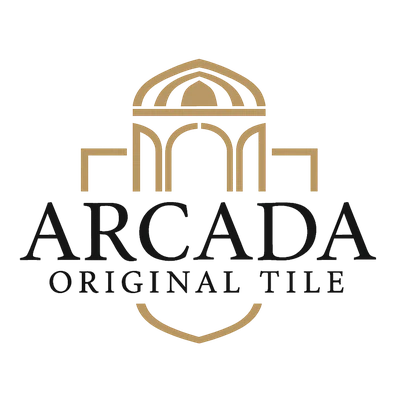

# ARCADA

**Trilingual catalogue and room visualizer for Algeria's exclusive ceramic tile manufacturer**

[arcadatile.com](https://www.arcadatile.com) · Designed and built by **[Alaa Younsi](https://alaayounsi.vercel.app/)**

</div>

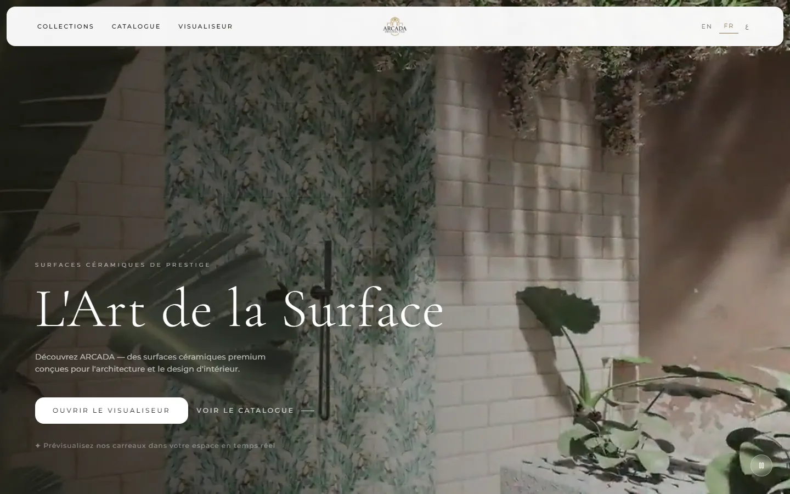

## About the project

ARCADA designs, manufactures and sells its own ceramic tiles in Algeria: 12 collections
of picket, leaf, scallop, hexagon and hand-painted tiles, sold directly from a
showroom in Sebala, Draria (Algiers). The collections don't exist anywhere else,
so the website serves as the brand's showroom online.

It does three things:

- **Presents the collections** as a browsable catalogue: 12 collections, 17 products
  and 73 colour variants, each with its own page and shareable URL.
- **Shows the tiles in real spaces.** The Visualizer places selected tiles in six
  rendered interiors (bathroom, kitchen, living room, pool, shop, restaurant).
- **Turns interest into conversations.** Every product and render has a one-tap
  WhatsApp enquiry, pre-filled with the exact tile, colour and space.

Prices are quoted on request, so the site has no cart. Its whole job is to make
the product desirable and make getting in touch effortless.

## Design concept

The site is designed as an **editorial lookbook**, closer to a printed luxury
catalogue than an online shop, because the brand's own idea is that tile is a
decorative art, not a commodity.

- **Warm, material palette** taken from fired clay and glaze: ivory `#FAF8F5`,
  sand `#F2EDE6`, bronze accent `#8B7355` and espresso `#1A1714`. Light and dark
  sections alternate like the spreads of a printed book.
- **Typography.** *Cormorant Garamond* for display type, set large and light, with
  widely tracked *Montserrat* for labels. Arabic gets its own pairing, *Amiri* and
  *Tajawal*, so it looks as considered as the Latin scripts.
- **Specimen cards.** Every tile is photographed on white and shown on its own
  card, like a sample on a showroom wall.
- **A floating, rounded navigation shell** that shrinks on scroll, hides while
  reading, and returns on the first scroll up. On desktop a mega-menu opens the
  full collection index.
- **Motion that stays out of the way.** Short fade-and-rise reveals, a muted hero
  film that plays only on connections that can afford it, and full respect for
  the OS *reduce motion* setting.
- **Three languages, one layout.** French, English and Arabic, with a true
  right-to-left mirror for Arabic (navigation, drawers, arrows and gradients).

## Screenshots

### Desktop

| | |
|:-:|:-:|
| 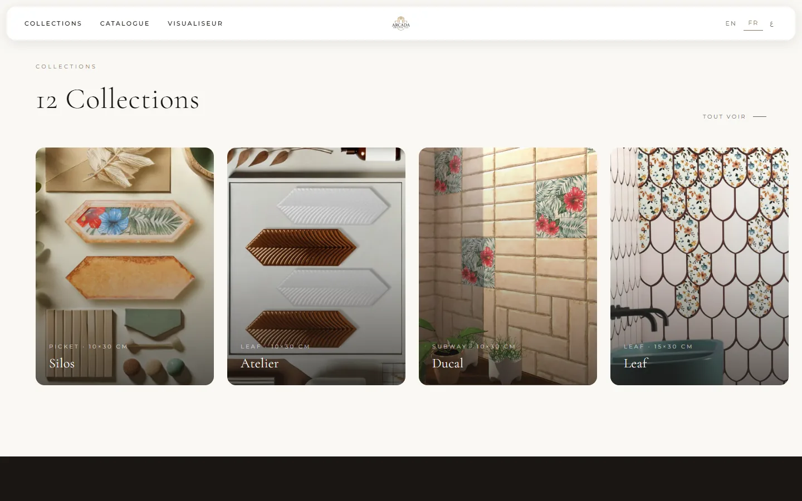 | 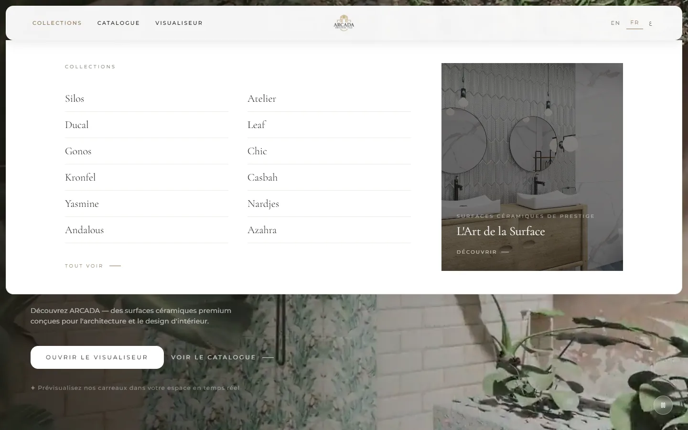 |
| Collections | Mega menu |
| 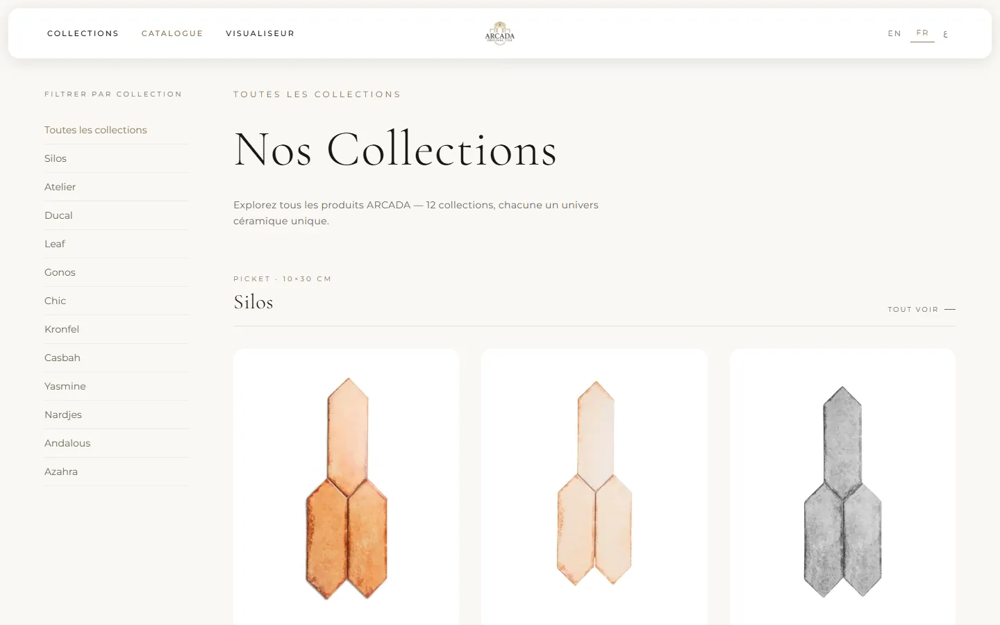 | 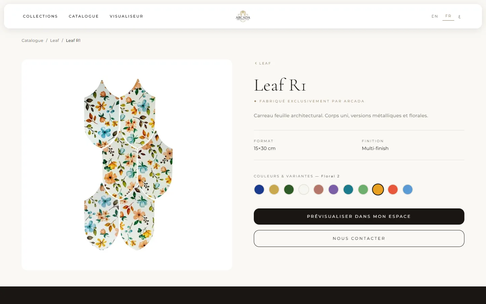 |
| Catalogue | Product |
| 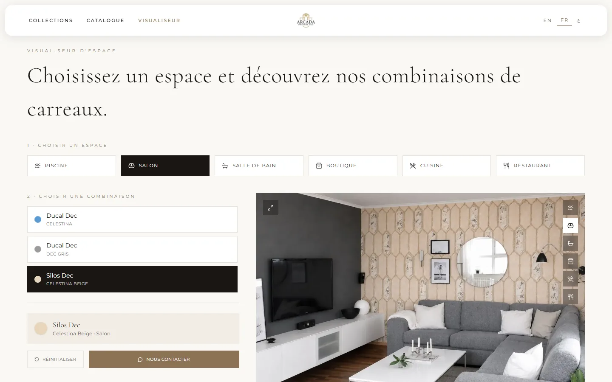 | 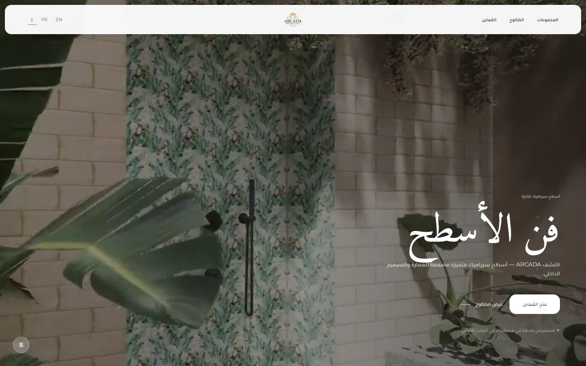 |
| Visualizer | Arabic (RTL) |

### Mobile

<table>
  <tr>
    <td align="center">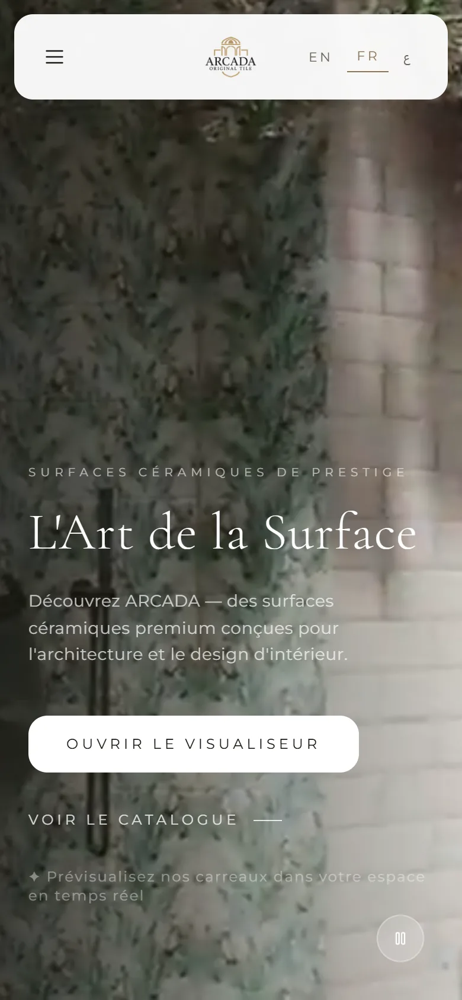<br />Home</td>
    <td align="center">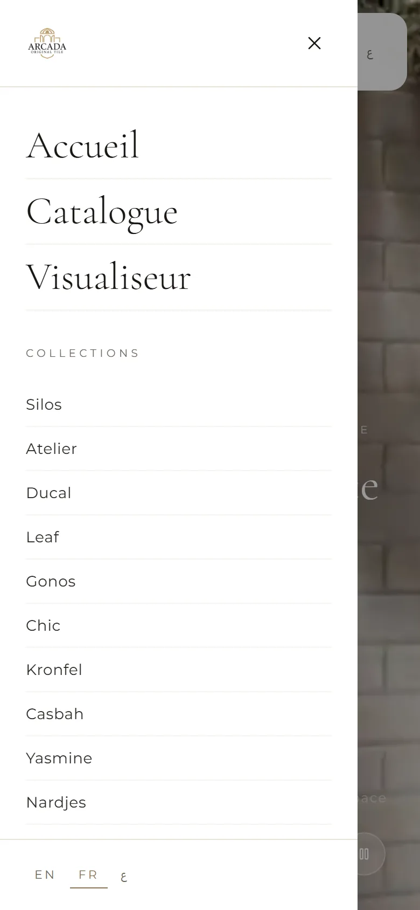<br />Menu</td>
    <td align="center">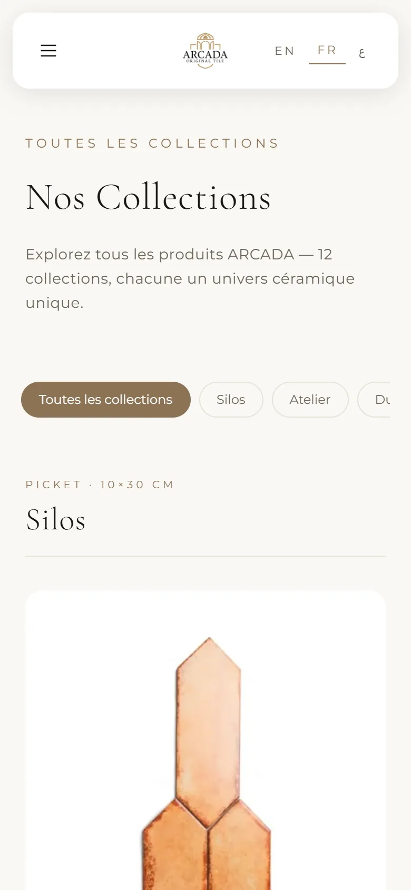<br />Catalogue</td>
    <td align="center">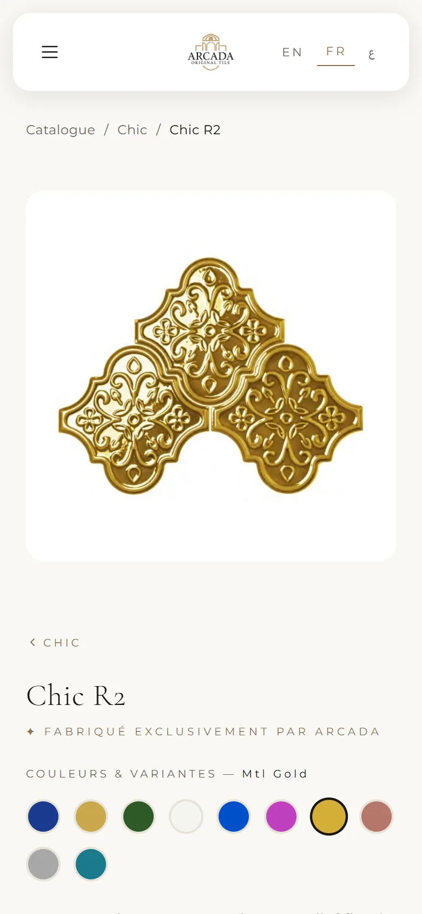<br />Product</td>
    <td align="center">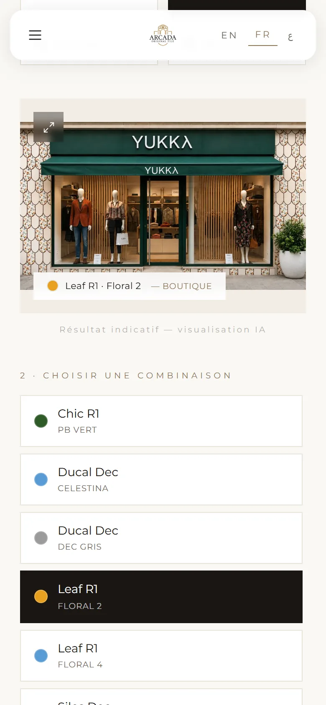<br />Visualizer</td>
  </tr>
</table>

## Features

- **Catalogue** with a sticky collection filter (desktop) or swipeable chips (mobile).
- **Collection pages** with hero imagery, every variant, and links to the other collections.
- **Product pages.** The selected colour lives in the URL (`?variant=`), so every
  colour is linkable, survives a reload, and can be shared.
- **Room Visualizer.** Pick a space, then a tile. Supports full-screen view, and
  "Preview in my space" on a product page opens that tile's render directly.
- **WhatsApp enquiries,** pre-filled in French for the showroom team.
- **French, English and Arabic,** detected from the browser and remembered once chosen.
- **Accessible:** keyboard-operable menus, Escape to close overlays, focus rings,
  labelled icon buttons, `aria-pressed` state on toggles, and reduced-motion support.

## Tech stack

| Area | Technology |
| --- | --- |
| UI | React 18, TypeScript (strict) |
| Build | Vite 7 |
| Styling | Tailwind CSS 3 with a custom design-token theme |
| Routing | React Router 7, with every page lazy-loaded |
| Motion | Framer Motion (`LazyMotion` + `m` components) |
| i18n | i18next / react-i18next (FR · EN · AR, RTL) |
| SEO | react-helmet-async, JSON-LD structured data |
| Icons | Lucide |
| Quality | Biome (lint + format), `tsc` type-checking |
| Hosting | Vercel |

The catalogue is typed static data (`src/data/catalogue.ts`). There is no
backend, database, or runtime API, so there's no server to attack and nothing to
keep online besides static files on a CDN.

## Performance

- **Code-split per page.** Each route is its own chunk, and React, Framer Motion
  and i18n are split into separate vendor chunks, so a content update doesn't
  invalidate them. First load is about 133 KB of gzipped JavaScript and 6 KB of CSS.
- **Media budget.** Product images are 800×800 WebP (about 25 KB on average),
  with lazy loading and async decoding. The hero image is preloaded only on the
  home page, through an HTTP `Link` header.
- **Adaptive hero video.** A 480p cut for phones (0.7 MB) and a full cut for
  desktop (1.5 MB). It loads only after first paint, and not at all on Save-Data
  or 2G/3G connections, where a still frame of the same footage stands in.
- **Zero-jank layouts.** Every image has intrinsic dimensions, and the visualizer
  uses a fixed frame. Cumulative Layout Shift measures 0–0.03 on every page.
- **Non-blocking fonts.** Preconnected, preloaded, `display=swap`. The Arabic
  fonts are served by `unicode-range`, so French and English visitors never
  download them.
- **Caching.** Hashed assets are `immutable` for a year, media for 30 days with
  `stale-while-revalidate`.

## SEO

- A unique `<title>`, description, canonical URL, Open Graph and Twitter card on every route.
- **Structured data:** `Organization`, `WebSite` and `Store` (showroom with geo
  coordinates) site-wide, plus `BreadcrumbList` and `Product` on catalogue pages.
- **Canonical URLs** drop the `?variant=` query, so all colours of a product
  consolidate onto one indexed page.
- `sitemap.xml` (31 URLs), `robots.txt`, web app manifest, and geo meta tags for Algiers.
- A purpose-built 1200×630 JPEG social card, since social crawlers handle WebP unreliably.
- Unknown URLs and mismatched collection/product URLs render a `noindex` 404.
- Semantic HTML: one `<h1>` per page, ordered headings, breadcrumb navigation and a
  correct `lang`/`dir` on `<html>` for each language.

## Security

The site is static, with no server code, database, user accounts, or secrets.
It ships with a strict set of HTTP headers (`vercel.json`):

| Header | Value / purpose |
| --- | --- |
| `Content-Security-Policy` | `default-src 'self'`, **no inline scripts**, fonts only from Google Fonts, `frame-ancestors 'none'`, `object-src 'none'`, `upgrade-insecure-requests` |
| `Strict-Transport-Security` | Two years, subdomains included, preload-ready |
| `X-Frame-Options` | `DENY`, preventing clickjacking |
| `X-Content-Type-Options` | `nosniff` |
| `Referrer-Policy` | `strict-origin-when-cross-origin` |
| `Cross-Origin-Opener-Policy` | `same-origin` |
| `Permissions-Policy` | Camera, microphone, geolocation, payment and USB disabled |

External links open with `rel="noopener"`, and all rendered text goes through
React's escaping. Dependencies are kept on patched releases (`npm audit`).

## Project structure

```text
├── docs/screenshots/        README imagery
├── public/                  Static assets, served as-is
│   ├── categories/          Collection cover images
│   ├── products/            Tile photography, one file per SKU (ARC-XXX-000.webp)
│   ├── scenes/              Empty rooms for the visualizer
│   ├── previews/            Rendered tile-in-room combinations
│   ├── robots.txt · sitemap.xml · site.webmanifest · og-image.jpg
│   └── background*.mp4      Hero film (desktop / mobile cuts)
├── src/
│   ├── components/
│   │   ├── catalogue/       Product card
│   │   ├── layout/          Navbar, Footer, Layout
│   │   ├── seo/             Per-route <head> and JSON-LD
│   │   └── ui/              Language switcher, scroll-to-top
│   ├── config/site.ts       Site URL, phone, social links, WhatsApp helper
│   ├── data/catalogue.ts    Collections, products and variants
│   ├── hooks/               Active language, adaptive hero video
│   ├── i18n/                i18next setup and FR / EN / AR copy
│   ├── pages/               Home, Catalogue, Category, Product, Preview, NotFound
│   └── types/               Shared domain types
├── index.html               Default meta tags and site-wide JSON-LD
├── vercel.json              Security headers, caching, SPA rewrites
└── biome.json               Lint and format rules
```

## Development

Requires Node.js 20.19 or newer.

```bash
npm install
npm run dev         # local dev server
npm run typecheck   # TypeScript
npm run lint        # Biome lint + format check
npm run build       # type-check and production build to dist/
npm run preview     # serve the production build
```

### Updating the catalogue

All catalogue content lives in `src/data/catalogue.ts`:

- **New colour:** add the image to `public/products/` and an entry to the product's `variants`.
- **New product:** add an entry to `PRODUCTS`, using an existing collection's `slug`.
- **New collection:** add it to `CATEGORIES` with a cover in `public/categories/`.
- **New visualizer render:** add `public/previews/combinations/{space}-{SKU}.webp`
  and list the SKU under that space in `src/pages/Preview.tsx`.

Add any new collection or product URL to `public/sitemap.xml`.

### Deployment

Pushes are deployed by Vercel, which runs `npm run build` and serves `dist/`
with the headers in `vercel.json`.

## Author

Designed and developed by **Alaa Younsi**, covering concept, UI/UX design,
front-end engineering, SEO and performance.
Portfolio: [alaayounsi.vercel.app](https://alaayounsi.vercel.app/)

## License

**© 2026 Alaa Younsi. All rights reserved.**

This is proprietary software. No part of this project may be copied, reused,
modified or distributed without prior written permission. See [LICENSE](LICENSE).
The ARCADA name, logo and product imagery belong to their respective owner.
